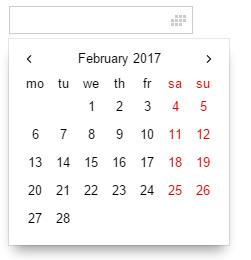
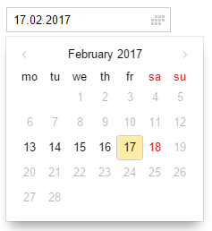
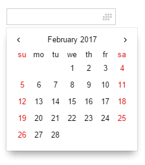

# Calendar for bem-components



On iOS and Android system calendar is used.

## Usage example

Together with `input`:
```js
{
    block: 'input',
    mods: {
        'has-calendar': true,
        size: 'm',
        theme: 'islands',
        readonly: true
    },
    weekdays: ['mo', 'tu', 'we', 'th', 'fr', 'sa', 'su'],
    months: ['January', 'February', 'March',
        'April', 'May', 'June', 'July',
        'August', 'September', 'October',
        'November', 'December'],
    val: '16.02.2017'
}
```

As a separate block:
```js
{
    block: 'calendar',
    js: {
        weekdays: ['mo', 'tu', 'we', 'th', 'fr', 'sa', 'su'],
        months: ['January', 'February', 'March',
            'April', 'May', 'June', 'July',
            'August', 'September', 'October',
            'November', 'December'],

    },
    mods: {
        theme: 'islands'
    }
}
```

You can set limits for dates using `earlierLimit` and `laterLimit` parameters.
```js
{
    block: 'input',
    mods: {
        'has-calendar': true,
        size: 'm',
        theme: 'islands',
        readonly: true
    },
    weekdays: ['mo', 'tu', 'we', 'th', 'fr', 'sa', 'su'],
    months: ['January', 'February', 'March',
            'April', 'May', 'June', 'July',
            'August', 'September', 'October',
            'November', 'December'],
    earlierLimit: '13.02.2017',
    laterLimit: '18.02.2017',
    val: '17.02.2017'
}
```


North-American calendar format can be enabled via `northAmericanSystem` property and setting first day of weekdays array to Sunday.
```js
{
    block: 'input',
    mods: {
        'has-calendar': true,
        size: 'm',
        theme: 'islands',
        readonly: true
    },
    weekdays: ['su','mo', 'tu', 'we', 'th', 'fr', 'sa'],
    months: ['January', 'February', 'March',
            'April', 'May', 'June', 'July',
            'August', 'September', 'October',
            'November', 'December'],
    northAmericanSystem:true
}
```
