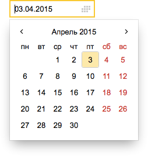
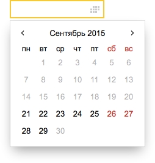
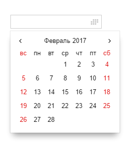

# Календарь на bem-components



На iOS и Android используется системный календарь.

## Пример использования

Вместе с `input`:
```js
{
    block: 'input',
    mods: {
        'has-calendar': true,
        size: 'm',
        theme: 'islands',
        readonly: true
    },
    weekdays: ['пн', 'вт', 'ср', 'чт', 'пт', 'сб', 'вс'],
    months: ['Январь', 'Февраль', 'Март',
        'Апрель', 'Май', 'Июнь',
        'Июль', 'Август', 'Сентябрь',
        'Октябрь', 'Ноябрь', 'Декабрь'],
    val: '11.11.2015'
}
```

Как отдельный блок:
```js
{
    block: 'calendar',
    js: {
        weekdays: ['пн', 'вт', 'ср', 'чт', 'пт', 'сб', 'вс'],
        months: ['Январь', 'Февраль', 'Март',
            'Апрель', 'Май', 'Июнь',
            'Июль', 'Август', 'Сентябрь',
            'Октябрь', 'Ноябрь', 'Декабрь'],
    },
    mods: {
        theme: 'islands'
    }
}
```

Есть возможность установить ограничения на выбор даты с помощью полей `earlierLimit` и `laterLimit`.
```js
{
    block: 'input',
    mods: {
        'has-calendar': true,
        size: 'm',
        theme: 'islands',
        readonly: true
    },
    weekdays: ['пн', 'вт', 'ср', 'чт', 'пт', 'сб', 'вс'],
    months: ['Январь', 'Февраль', 'Март',
        'Апрель', 'Май', 'Июнь',
        'Июль', 'Август', 'Сентябрь',
        'Октябрь', 'Ноябрь', 'Декабрь'],
    earlierLimit: '11.10.2015',
    laterLimit: '11.12.2015',
    val: '11.11.2015'
}
```


Северо-Американский формат календаря может быть включен, используя `northAmericanSystem` и выставив Воскресенье, как первый день в массиве дней недели.
```js
{
    block: 'input',
    mods: {
        'has-calendar': true,
        size: 'm',
        theme: 'islands',
        readonly: true
    },
    weekdays: ['su','mo', 'tu', 'we', 'th', 'fr', 'sa'],
    months: ['January', 'February', 'March',
            'April', 'May', 'June', 'July',
            'August', 'September', 'October',
            'November', 'December'],
    northAmericanSystem:true
}
```
